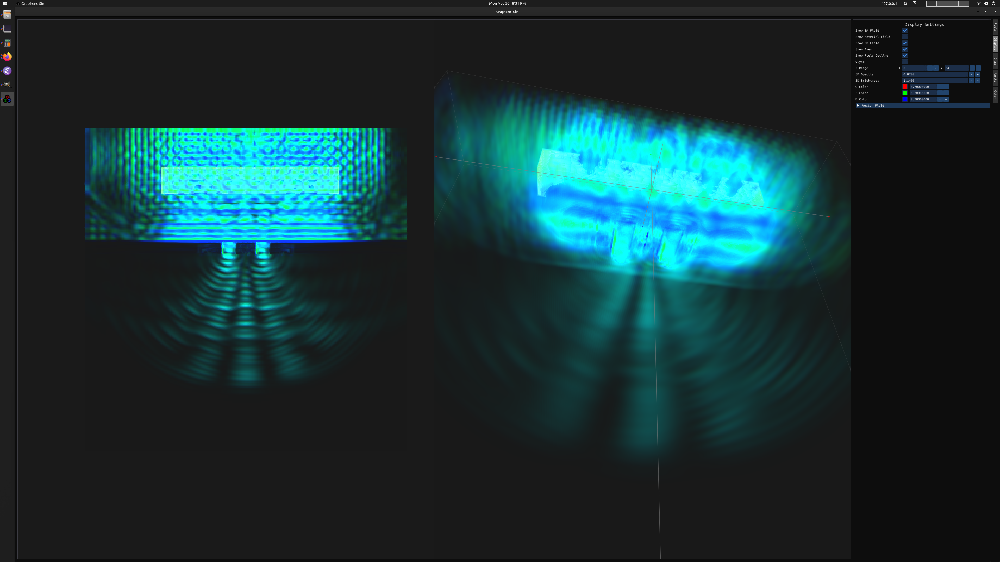

# graphene

**(Note: in development)**

Interactive simulation of a subset of Maxwell's equations in 3D. Part of an academic project involving current generated in graphene via the motion of ions in an electrolytic solution.

The field equations are solved over an Eulerian grid given initial conditions and user input, and results are rendered with a ray marching algorithm (uses CUDA).

Most parameters are configurable in the settings. With the right tuning, many patterns can be generated similar to those seen in physical electromagnetic phenomena.

[Notable screenshots/video](https://drive.google.com/drive/folders/1zEHwl77b6Ec9WtRbWh4XJpnevpABOP_p?usp=sharing)

&nbsp;
&nbsp;
|  |
|:--:|
| *Simple 2D wave interference* |

&nbsp;
&nbsp;
|  |
|:--:|
| *Refraction through a convex lens with a higher index of refraction* |

&nbsp;
&nbsp;
|  |
|:--:|
| *External reflection* |

&nbsp;
&nbsp;
|  |
|:--:|
| *Double Slit experiment* |

&nbsp;
&nbsp;
|  |
|:--:|
| *Emergent patterns with similarities to physical phenomena (1)* |

&nbsp;
&nbsp;
|  |
|:--:|
| *Emergent patterns with similarities to physical phenomena (2)* |

&nbsp;
&nbsp;
|  |
|:--:|
| *Complex evolution of 3D structures* |

&nbsp;
&nbsp;
|  |
|:--:|
| *Adjustable blending parameters can create interesting effects* |

&nbsp;
&nbsp;
|  |
|:--:|
| *Parametric initial conditions* |

&nbsp;
&nbsp;
|  |
|:--:|
| *...?* |

&nbsp;
&nbsp;

# Usage
##### NOTE: Currently only supports Ubuntu(20.04), but may build on other systems with minor modifications

## Basic dependencies
    $ sudo apt install build-essential cmake libglew-dev libglfw3-dev nlohmann-json3-dev libfreetype6-dev
        
&nbsp; 
&nbsp;

## CUDA
##### (requires a compatible NVIDIA graphics card)
#### Install NVIDIA driver
    $ sudo apt purge *nvidia*
    $ sudo apt autoremove
    $ sudo apt install nvidia-driver-460
#### Install CUDA (11.2)
    $ sudo apt install nvidia-cuda-toolkit
    
&nbsp;
&nbsp;
        
## Build/Run
    $ ./make-release.sh
    $ ./graphene

&nbsp;
&nbsp;

## Dependencies
- GLFW3
  - https://www.glfw.org/
- GLEW
  - http://glew.sourceforge.net/
- Dear ImGui,
  - https://github.com/ocornut/imgui
- FreeType
  - https://www.freetype.org
- stb (stb_image, std_image_write)
  - https://github.com/nothings/stb
- nlohmann/json
  - https://github.com/nlohmann/json

## Contact
* skothr@gmail.com
